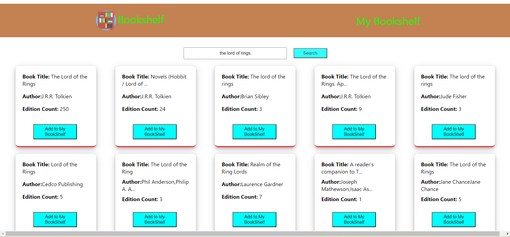
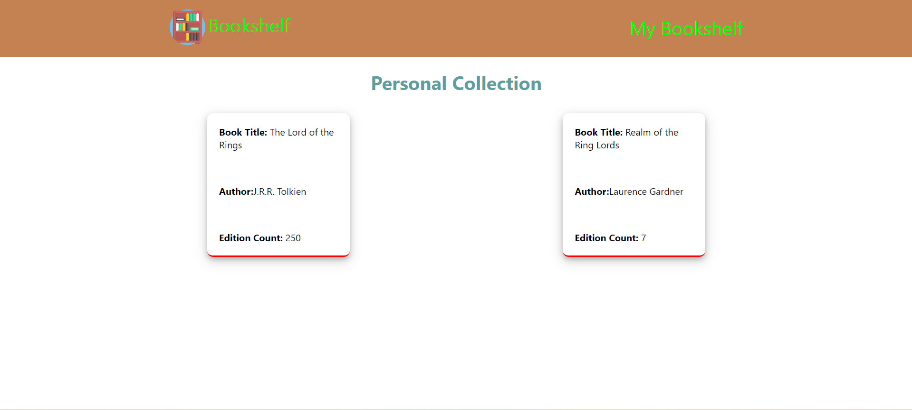

# Personal Bookshelf

This is a simple React application that allows users to search for books and add them to their personal bookshelf.

## Features

1. **Search**: Users can search for books by their name.
2. **Add to Bookshelf**: Users can add books to their personal bookshelf.
3. **Persistent Storage**: The application uses persistent storage to save the user's bookshelf.

## Live Demo: [https://personal-bookshelf-ihgd.onrender.com](https://personal-bookshelf-ihgd.onrender.com)


## Technologies Used

- React
- Redux/Redux-toolkit (for state management)
- CSS Modules (for styling)
- Persistent Storage (local storage )
## Folder Structure

```
public
| | index.html
src
| |
| > components
| | |
| | > Error
| | | |
| | | error.js
| | > Home
| | | |
| | | home.js
| | | home.module.css
| | > MyCollection
| | | |
| | | collection.js
| | | collection.module.css
| | > Navbar
| | | |
| | | navbar.js
| | | navbar.module.css
| | > Store
| | | |
| | | store.js
| > redux
| | |
| | collectionReducer.js
| > App.js
```

## Getting Started

To get started with this project, follow these steps:

1. Clone this repository.

```
https://github.com/shaikhsohel0082/personal-bookshelf.git
```

2. Install the necessary dependencies by running `npm install`.
3. Start the development server by running `npm start`.
4. Open [http://localhost:3000](http://localhost:3000) to view it in the browser.

### Home

### MyBookShelf


## Contributing

Contributions are welcome! Feel free to submit pull requests or open issues.

## License

This project is licensed under the MIT License - see the [LICENSE](LICENSE) file for details.
